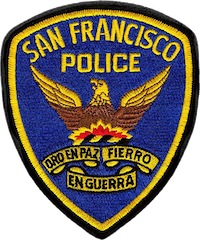
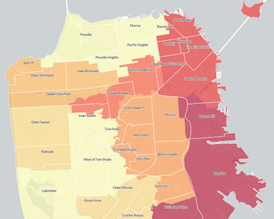
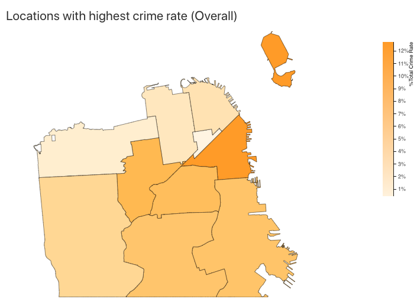

## 
Alpha Release

---

### Background and Motivation: 

The police officers at the San Francisco Police Department work hard every day to keep our city safe. Despite the measures taken by the police department, the disturbing elements in the society keep on carrying out their deleterious deeds that disturbs the peace and tranquility of the community. 

The objective of this project is to help the police department to gain insights about incidents carried out in the past and predict the crime based upon the patterns in dataset. 

### Overview
Overall there will be four visualizations, created using different visualization techniques. We'll start with an abstract view in the first visuaization. Further, visualizations  will add granularity that will to allow the police department to study patterns from the past clearly and help them in predicting crime.

### Progress
- Overall the preprocessing of data have been looked upon. But, further processing needs to be done.
 
#### P1: Compare the different regions of San Francisco to identity locations with high crime rate (total) for different years.

- Yearwise filteration of data is in progress
- A basic map has been created in d3js. 
- Integration of data with visualization is in progress.
- The visualization will be completed by the end of the week along with hover support

---

- Expected (Posted in Proposal)

- Current (Created in d3.js)

---

### Upcoming immediate milestones

- `(Week 2)` P2 Spread of crime across city with year/crime selection
- `(Week 3)` P3: Crime Variation for multiple crime across different months for a year

#### Roadblocks
- Working with large dataset is not easy, different ways of filtration are being looked into.
